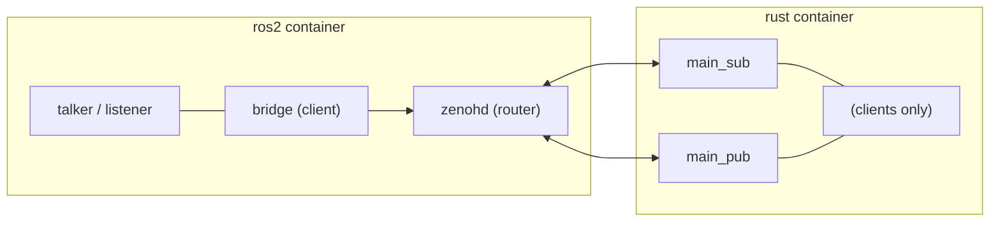
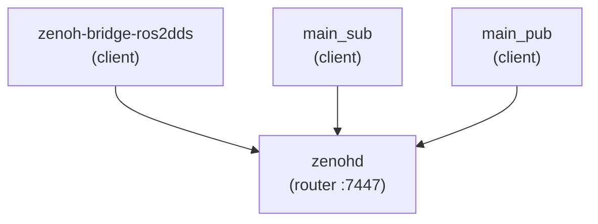

# Sample 3 — DDS + Zenoh Bridge

Hybrid setup: ROS 2 nodes stay on **local DDS**, while `zenoh-bridge-ros2dds` forwards traffic through **Zenoh** for remote Rust pub/sub in a separate container.

## Tech stack & structure



**1 router + 3 client sessions:**



## Demo contract

| Item | Value |
|------|-------|
| ROS topic | `/demo/chatter` |
| Type | `std_msgs/msg/String` |
| Zenoh key | `demo/chatter` (bridge mapping) |
| ROS leg | C++ talker + listener (DDS) |
| Rust leg | `main_pub` + `main_sub` |

## Prerequisites

- **Docker** with Compose v2 — see [docs/prerequisites.md](../../docs/prerequisites.md)
- Linux recommended (`network_mode: host`)

Two containers: **ros2** (zenohd + bridge + talker/listener) and **rust** (`main_sub` + `main_pub`).

## Build and run

From repo root:

```bash
docker compose -f samples/03-dds-zenoh-bridge/docker-compose.yml up --build --abort-on-container-exit
```

Bounded demo (phase 1 ~5 s, phase 2 ~4 s). You should see:

**Phase 1 — ROS talker → Rust sub**

- ROS `[talker]: Publishing: 'Hello N'` (×4)
- Rust `[info] demo/chatter: …, data='Hello N'` — CDR decoded in `main_sub`

**Phase 2 — Rust pub → ROS listener**

- Rust `[pub] put seq=N text='Hello 0 from Rust' …` (×4, 0-based like ROS talker)
- ROS `[listener]: I heard: 'Hello 0 from Rust'` … `'Hello 3 from Rust'`

## Wire format & decode

The bridge forwards ROS messages as **CDR bytes** on Zenoh (`zenoh/bytes`, typically 16 bytes for `"Hello N"`). ROS and Rust do not decode the same way:

| Direction | Path | Who encodes | Who decodes |
|-----------|------|-------------|-------------|
| **Phase 1** — ROS → Rust | talker → DDS → bridge → `main_sub` | ROS / RMW (automatic CDR) | **Rust** — `main_sub` decodes `std_msgs/msg/String` CDR (`wire/ros_msg_cdr.rs`) and logs `data='…'` |
| **Phase 2** — Rust → ROS | `main_pub` → bridge → listener | **Rust** — `main_pub` encodes CDR when `ROS_MSG_TYPE=std_msgs/msg/String` | ROS / `rclcpp` (automatic CDR) → `I heard: '…'` |

So phase 2 “just works” on the ROS side because the listener is a native ROS 2 node. Phase 1 needs explicit decode in Rust: `main_sub` is a plain Zenoh client (no `rclrs`/RMW), not an ROS node.

Implementation: encode/decode helpers live in `rust/src/wire/ros_msg_cdr.rs`; Docker sets `ROS_MSG_TYPE=std_msgs/msg/String` for `main_pub`. Both ROS talker and Rust pub use **0-based** `Hello N` numbering (`Hello 0` … `Hello 3` over 4 s).

## From the notebook

```python
from demo_runner import build_sample3_docker, run_sample3_docker_demo

build_sample3_docker()
print(run_sample3_docker_demo(phase1_sec=5, phase2_sec=4))
```

## Layout

```text
cpp/demo_nodes/     ROS talker + listener (built into ros2 image)
rust/               Zenoh pub/sub clients (built into rust image)
configs/            bridge JSON5 + pub/sub YAML (4 files)
docker/ros2/        ros2 container Dockerfile + run script
docker/rust/        rust container Dockerfile + run script
```

## Differences vs other samples

| | Sample 1 | Sample 2 | Sample 3 |
|--|----------|----------|----------|
| ROS middleware | DDS | rmw_zenoh | DDS (local) |
| Zenoh role | none | RMW | bridge + remote clients |
| Mixed stacks | no | no | yes |
| Docker | 1 container | 1 container | **2 containers** |

## See also

- [configs/README.md](configs/README.md) — config file naming
- [Sample 1](../01-traditional-dds/README.md) — DDS baseline
- [Sample 2](../02-rmw-zenoh/README.md) — full Zenoh RMW
