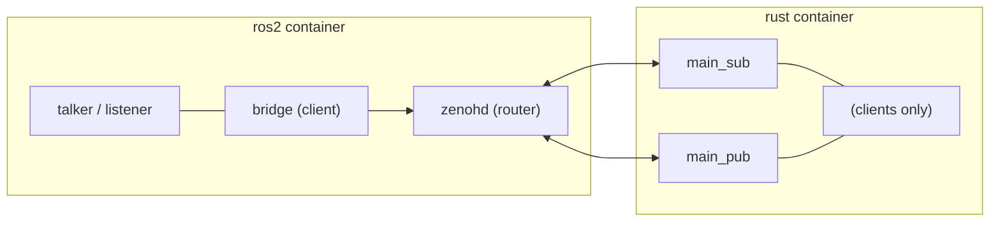
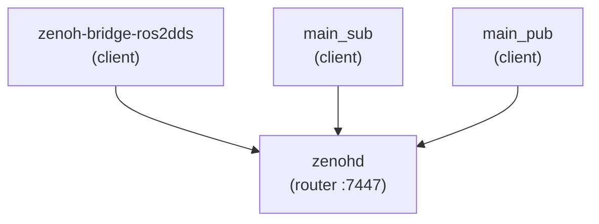

# Sample 3 — DDS + Zenoh Bridge

Hybrid setup: ROS 2 nodes stay on **local DDS**, while `zenoh-bridge-ros2dds` forwards traffic through **Zenoh** for remote Rust pub/sub in a separate container.

## Tech stack & structure



**1 router + 3 client sessions:**



## Demo contract

| Item | Value |
|------|-------|
| ROS topic | `/demo/chatter` |
| Type | `std_msgs/msg/String` |
| Zenoh key | `demo/chatter` (bridge mapping) |
| ROS leg | C++ talker + listener (DDS) |
| Rust leg | `main_pub` + `main_sub` |

## Prerequisites

- **Docker** with Compose v2 — see [docs/prerequisites.md](../../docs/prerequisites.md)
- Linux recommended (`network_mode: host`)

Two containers: **ros2** (zenohd + bridge + talker/listener) and **rust** (`main_sub` + `main_pub`).

## Build and run

From repo root:

```bash
docker compose -f samples/03-dds-zenoh-bridge/docker-compose.yml up --build --abort-on-container-exit
```

Bounded demo (~8 s). You should see:

- ROS talker `Publishing: 'Hello N'` and Rust sub samples on `demo/chatter`
- Rust pub `(pub) put …` and ROS listener `I heard: 'Hello from Rust'`

## From the notebook

```python
from demo_runner import build_sample3_docker, run_sample3_docker_demo

build_sample3_docker()
print(run_sample3_docker_demo(duration_sec=8))
```

## Layout

```text
cpp/demo_nodes/     ROS talker + listener (built into ros2 image)
rust/               Zenoh pub/sub clients (built into rust image)
configs/            bridge JSON5 + agent YAML
docker/ros2/        ros2 container Dockerfile + run script
docker/rust/        rust container Dockerfile + run script
scripts/            advanced host scripts (reference only)
```

## Differences vs other samples

| | Sample 1 | Sample 2 | Sample 3 |
|--|----------|----------|----------|
| ROS middleware | DDS | rmw_zenoh | DDS (local) |
| Zenoh role | none | RMW | bridge + remote clients |
| Mixed stacks | no | no | yes |
| Docker | 1 container | 1 container | **2 containers** |

## See also

- [configs/README.md](configs/README.md) — config file naming
- [Sample 1](../01-traditional-dds/README.md) — DDS baseline
- [Sample 2](../02-rmw-zenoh/README.md) — full Zenoh RMW
